# Data Ingestion Architecture

This document describes the end-to-end data ingestion pipeline for Open Estate AI, from scraping real estate data to making it searchable through vector embeddings.

---

## Overview

The ingestion architecture consists of two main pipelines working together:

1. **Scraping Pipeline** - Collects real estate data from various sources
2. **Data Lake Pipeline** - Processes, transforms, and indexes data for search

---

## Complete Ingestion Flow

```mermaid
flowchart TB
    subgraph Scraping["📥 Scraping Layer"]
        direction TB
        User([👤 User/Client])
        
        subgraph AppRunner["🚀 AWS App Runner"]
            direction LR
            API["🌐 FastAPI<br/>Port 8080"]
            Agent["🤖 AI Agent<br/>Scraper"]
            MCP["⚙️ MCP Server<br/>Scraping Logic"]
            Browser["🌍 Playwright<br/>Headless Browser"]
        end
        
        External["🏢 Data Sources<br/><i>UP RERA, etc.</i>"]
    end
    
    subgraph DataLake["☁️ AWS Data Lake Infrastructure"]
        direction TB
        
        subgraph Storage["💾 Storage Layer"]
            direction LR
            S3Raw[("📦 S3 Raw Bucket<br/>JSON Data<br/><i>year/month/day</i>")]
            S3Vectors[("🔍 S3 Vectors<br/>Embeddings<br/><i>384 dimensions</i>")]
        end
        
        subgraph Processing["⚙️ Processing Pipeline"]
            direction TB
            Lambda["🔧 Lambda Function<br/>Ingest & Transform<br/><i>Python 3.12</i>"]
            SageMaker["🤖 SageMaker Endpoint<br/>all-MiniLM-L6-v2<br/><i>Embedding Model</i>"]
        end
        
        subgraph Search["🔎 Search Layer"]
            direction TB
            VectorIndex["📊 Vector Index<br/>property-research<br/><i>Cosine Similarity</i>"]
        end
    end
    
    subgraph Applications["🎯 Application Layer"]
        SearchAgent["🔍 Search Agent<br/><i>Multi-Agent System</i>"]
        UIApp["💻 UI Applications<br/><i>Web, Mobile</i>"]
    end
    
    User -->|"1️⃣ HTTP GET<br/>?max_projects=N"| API
    API -->|"2️⃣ Coordinate"| Agent
    Agent -->|"3️⃣ Call MCP Tool"| MCP
    MCP -->|"4️⃣ Launch"| Browser
    Browser -->|"5️⃣ Scrape HTML"| External
    External -->|"6️⃣ Return Data"| Browser
    Browser -->|"7️⃣ Parse JSON"| MCP
    MCP -->|"8️⃣ Return Results"| Agent
    Agent -->|"9️⃣ Upload NDJSON"| S3Raw
    
    S3Raw -->|"🔟 Trigger<br/>S3 Event"| Lambda
    Lambda -->|"1️⃣1️⃣ Read<br/>raw_text"| S3Raw
    Lambda -->|"1️⃣2️⃣ Get<br/>Embeddings"| SageMaker
    SageMaker -->|"1️⃣3️⃣ Return<br/>Vectors"| Lambda
    Lambda -->|"1️⃣4️⃣ Store<br/>with Metadata"| S3Vectors
    S3Vectors -->|"1️⃣5️⃣ Index"| VectorIndex
    
    SearchAgent -->|"1️⃣6️⃣ Query<br/>Natural Language"| VectorIndex
    UIApp -->|"1️⃣6️⃣ Query<br/>Natural Language"| VectorIndex
    VectorIndex -->|"1️⃣7️⃣ Return<br/>Similar Properties"| SearchAgent
    VectorIndex -->|"1️⃣7️⃣ Return<br/>Similar Properties"| UIApp
    
    classDef userStyle fill:#4A90E2,stroke:#2E5C8A,stroke-width:3px,color:#fff
    classDef apiStyle fill:#FF6B6B,stroke:#C92A2A,stroke-width:3px,color:#fff
    classDef agentStyle fill:#A855F7,stroke:#7C3AED,stroke-width:3px,color:#fff
    classDef mcpStyle fill:#10B981,stroke:#059669,stroke-width:3px,color:#fff
    classDef browserStyle fill:#F59E0B,stroke:#D97706,stroke-width:3px,color:#fff
    classDef storageStyle fill:#3B82F6,stroke:#1E40AF,stroke-width:3px,color:#fff
    classDef processStyle fill:#F59E0B,stroke:#D97706,stroke-width:3px,color:#fff
    classDef searchStyle fill:#8B5CF6,stroke:#6D28D9,stroke-width:3px,color:#fff
    classDef externalStyle fill:#14B8A6,stroke:#0F766E,stroke-width:3px,color:#fff
    classDef appStyle fill:#EC4899,stroke:#BE185D,stroke-width:3px,color:#fff
    classDef scrapingGroupStyle fill:#FFE6E6,stroke:#FF6B6B,stroke-width:3px,color:#C92A2A
    classDef appRunnerStyle fill:#232F3E,stroke:#FF9900,stroke-width:3px,color:#FF9900
    classDef datalakeStyle fill:#FFF9E6,stroke:#FF9900,stroke-width:3px,color:#232F3E
    classDef storageGroupStyle fill:#E6F7FF,stroke:#1890FF,stroke-width:3px,color:#003A70
    classDef processGroupStyle fill:#FFF7E6,stroke:#FA8C16,stroke-width:3px,color:#AD4E00
    classDef searchGroupStyle fill:#F0E6FF,stroke:#9254DE,stroke-width:3px,color:#531DAB
    classDef appGroupStyle fill:#FCE7F3,stroke:#EC4899,stroke-width:3px,color:#9F1239
    
    class User userStyle
    class API apiStyle
    class Agent agentStyle
    class MCP mcpStyle
    class Browser browserStyle
    class S3Raw,S3Vectors storageStyle
    class Lambda,SageMaker processStyle
    class VectorIndex searchStyle
    class External externalStyle
    class SearchAgent,UIApp appStyle
    class Scraping scrapingGroupStyle
    class AppRunner appRunnerStyle
    class DataLake datalakeStyle
    class Storage storageGroupStyle
    class Processing processGroupStyle
    class Search searchGroupStyle
    class Applications appGroupStyle
```



---

## Pipeline Components

### 1. Scraping Layer

**Purpose**: Collect real estate data from various sources (UP RERA, property portals, etc.)

#### Components:
- **FastAPI Service** (Port 8080)
  - HTTP endpoint for triggering scrapes
  - Accepts `max_projects` parameter
  - Returns scraping status and metadata

- **AI Agent Scraper**
  - Coordinates the scraping workflow
  - Uses AWS Bedrock (Claude Haiku) for intelligent scraping
  - Manages retry logic and error handling

- **MCP Server (Model Context Protocol)**
  - Implements scraping logic
  - Handles pagination and data extraction
  - Returns lightweight metadata to avoid token limits

- **Playwright Browser**
  - Headless browser automation
  - Memory-optimized for cloud deployment
  - Extracts structured data from web pages

#### Infrastructure:
- **AWS App Runner**: Serverless container service (1 vCPU, 2GB RAM)
- **AWS ECR**: Container image registry
- **IAM Roles**: Bedrock and S3 access permissions

#### Data Format:
Each scraped record includes a `raw_text` field for vector search:
```
"Project Name: X | RERA Number: Y | Promoter: Z | Type: A | District: B | ..."
```

---

### 2. Storage Layer

**Purpose**: Store raw and processed data in appropriate formats

#### Components:
- **S3 Raw Bucket**
  - Stores scraped data in NDJSON format
  - Partitioned by date: `year=YYYY/month=MM/day=DD/`
  - Versioning enabled for data recovery
  - Automatic encryption (SSE-S3)

- **S3 Vectors Bucket**
  - Specialized vector database
  - Stores 384-dimensional embeddings
  - Metadata includes project details
  - Optimized for similarity search

#### Data Partitioning:
```
s3://bucket/prefix/year=2025/month=11/day=16/timestamp_runid.json
```

---

### 3. Processing Pipeline

**Purpose**: Transform raw data into searchable vectors

#### Components:
- **Lambda Function**
  - Triggered automatically by S3 events
  - Runtime: Python 3.12
  - Memory: 1024 MB
  - Timeout: 300 seconds
  - Parallel processing: 10 workers (ThreadPoolExecutor)

- **SageMaker Endpoint**
  - Model: `sentence-transformers/all-MiniLM-L6-v2`
  - Instance: `ml.t2.medium`
  - Output: 384-dimensional vectors
  - Optimized for semantic similarity

#### Processing Steps:
1. Read NDJSON file from S3 Raw
2. Parse each record's `raw_text` field
3. Generate embeddings via SageMaker
4. Store vectors with metadata in S3 Vectors
5. Retry failed records (up to 3 attempts)

#### Error Handling:
- Transient errors (timeout, throttling): Retry
- Permanent errors (invalid JSON): Skip and log
- Partial failures: Continue processing remaining records

---

### 4. Search Layer

**Purpose**: Enable fast semantic search over property data

#### Components:
- **Vector Index**
  - Name: `property-research`
  - Dimensions: 384
  - Distance Metric: Cosine similarity
  - Indexed automatically from S3 Vectors

#### Query Capabilities:
- Natural language queries: "3 bedroom apartments in Noida"
- Semantic similarity matching
- Metadata filtering (price, location, type)
- Top-K results with similarity scores

---

## Data Flow Details

### Step-by-Step Process

**Phase 1: Data Collection (Steps 1-9)**
1. User triggers scrape via HTTP API
2. FastAPI routes request to AI Agent
3. Agent invokes MCP Server tool
4. MCP launches Playwright browser
5. Browser scrapes target website (UP RERA)
6. Website returns HTML data
7. Browser parses and extracts JSON
8. MCP returns results to Agent
9. Agent uploads NDJSON to S3 Raw bucket

**Phase 2: Processing (Steps 10-15)**
10. S3 event triggers Lambda function
11. Lambda reads `raw_text` from each record
12. Lambda sends text to SageMaker endpoint
13. SageMaker returns vector embeddings
14. Lambda stores vectors with metadata in S3 Vectors
15. Vectors are automatically indexed

**Phase 3: Search (Steps 16-17)**
16. Applications query vector index with natural language
17. System returns similar properties based on semantic similarity

---


## References

- [Scraper Documentation](https://github.com/open-estate-ai/real-estate-scrapers/blob/main/scrapers/up-rera-scraper-app-runner/README.md)
- [Data Lake Documentation](https://github.com/open-estate-ai/real-estate-datalake/blob/main/README.md)
- [AWS App Runner Docs](https://docs.aws.amazon.com/apprunner/)
- [AWS Lambda Docs](https://docs.aws.amazon.com/lambda/)
- [SageMaker Endpoints](https://docs.aws.amazon.com/sagemaker/latest/dg/realtime-endpoints.html)
- [S3 Vectors (Preview)](https://docs.aws.amazon.com/AmazonS3/latest/userguide/s3-vector-storage.html)

---

## Contributing

For questions, improvements, or bug reports:
- Open an issue on [GitHub](https://github.com/open-estate-ai/real-estate-docs)
- Join our [Slack community](https://join.slack.com/t/open-estate-ai/shared_invite/zt-3dk65gu4h-SmBeySssL732C3ReHL_ejQ)

---

## License

See repository root for license information.
