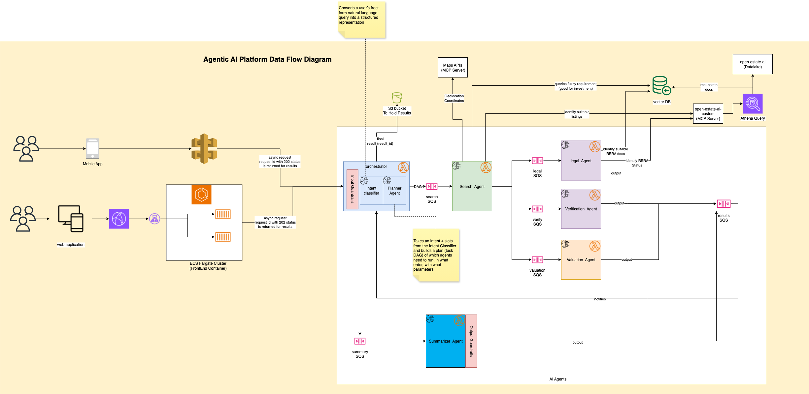

# Multi-Agent Architecture

This page gives a simple overview of the Open Estate AI multi agent architecture and how the main pieces fit together.



## Key Components

- **Orchestrator**  
  The central service that receives user queries, manages agents, and coordinates all tasks and workflows.

- **Intent Classifier Agent**  
  An agent that takes a user’s query (free text) and converts it into structured intent and slots.
  - **Input:**  
    `{ request_id, text, user_context }`
  - **Output:**  
    `{ intent, slots, confidence, model_version }`
  - Example:  
    Input: "Find RERA-approved plots under 80 lakh near metro"  
    Output:  
    ```json
    {
      "intent": "find_listings",
      "slots": {
        "property_type": "plot",
        "max_price_inr": 8000000,
        "near": "metro",
        "goal": "investment",
        "rera_status": "approved"
      },
      "confidence": 0.92,
      "model_version": "intent-clf-v1.0.3"
    }
    ```

- **Planner Agent**  
  An agent that takes the intent and slots and builds a workflow (DAG) of tasks for other agents.
  - **Input:**  
    `{ request_id, intent, slots, user_context, policy_overrides }`
  - **Output:**  
    `{ dag: [ { task_id, task_type, payload_template, depends_on, timeout_ms, parallel_for } ], planner_meta }`
  - Example:  
    Input: intent and slots from above  
    Output:  
    ```json
    {
      "dag": [
        {
          "task_id": "t1_search",
          "task_type": "search_listings",
          "payload_template": {
            "property_type": "{{slots.property_type}}",
            "max_price_inr": "{{slots.max_price_inr}}",
            "near": "{{slots.near}}"
          },
          "depends_on": [],
          "timeout_ms": 5000
        },
        {
          "task_id": "t2_legal",
          "task_type": "legal_check",
          "payload_template": {
            "listing_ids": "{{t1_search.candidates.ids}}"
          },
          "depends_on": ["t1_search"],
          "timeout_ms": 8000,
          "parallel_for": "candidates"
        }
      ],
      "planner_meta": {
        "version": "planner-v1.1.0",
        "policy": "default"
      }
    }
    ```

- **Other Agents**  
  Specialized agents that perform tasks such as [searching listings](./agents/search-agent.md), [legal checks](./agents/legal-agent.md) , [valuation](./agents/valuation-agent.md), and [verification](./agents/verification-agent.md).  
  Each agent receives a task message, processes it, and returns a result.

- **Message Queue**  
  Used for communication between the Orchestrator and agents. Tasks and results are sent via topics (e.g., tasks.search, tasks.legal).

- **Audit & Metrics**  
  All actions, results, and provenance are logged for traceability and debugging.

---

## How a User Query is Handled

1. **User submits a query**  
   Example: "Find RERA-approved plots under ₹80 lakh near metro, good for investment."

2. **Intent Classification**  
   Orchestrator sends the query to the Intent Classifier Agent, which extracts intent and slots.

3. **Planning**  
   Orchestrator sends the intent and slots to the Planner Agent, which creates a DAG of tasks.

4. **Task Execution**  
   Orchestrator enqueues tasks to the message queue.  
   Agents pick up tasks, perform their work, and publish results.

5. **Aggregation & Guardrails**  
   Orchestrator collects results, runs checks (e.g., confidence, source verification), and composes the final answer.

6. **Response Delivery**  
   Orchestrator returns results to the user. If some tasks are slow (like phone verification), it can return partial results and update later.

7. **Human Escalation**  
   If confidence is low or a guardrail fails, Orchestrator creates a human review ticket.

---

## Summary

Open Estate AI uses a modular, agent-based architecture to turn user queries into structured workflows.  
The Orchestrator coordinates the Intent Classifier Agent, Planner Agent, and other specialized agents to ensure reliable and traceable results.

If you have questions or want to see more examples, check the guides or reach out on [Slack](https://join.slack.com/t/open-estate-ai/shared_invite/zt-3dk65gu4h-SmBeySssL732C3ReHL_ejQ) or open an issue on [GitHub](https://github.com/open-estate-ai/real-estate-docs)!