# Architecture Overview

Welcome to the Open Estate AI architecture documentation. This page provides a high-level view of how our system components work together to deliver intelligent property search and insights.

---

## System Overview

Open Estate AI is built on two main architectural pillars that work together seamlessly:

1. **[Data Ingestion Architecture](./ingestion-architecture.md)** - Collects, processes, and indexes real estate data
2. **[Multi-Agent Architecture](./multi-agent-architecture.md)** - Delivers intelligent search and insights through AI agents

---

## How They Connect

```mermaid
flowchart TB
    subgraph Sources["🌐 Data Sources"]
        RERA["UP RERA Website"]
        Other["Other Property Portals"]
    end
    
    subgraph Ingestion["📥 Data Ingestion Pipeline"]
        direction TB
        Scrapers["🤖 Scrapers<br/><i>Collect Data</i>"]
        S3Raw["📦 S3 Raw<br/><i>Store JSON</i>"]
        Lambda["⚙️ Lambda<br/><i>Process</i>"]
        SageMaker["🧠 SageMaker<br/><i>Embeddings</i>"]
        S3Vectors["🔍 S3 Vectors<br/><i>Indexed</i>"]
    end
    
    subgraph MultiAgent["🎯 Multi-Agent System"]
        direction TB
        UI["💻 User Interface<br/><i>Web/Mobile</i>"]
        Orchestrator["🎭 Orchestrator<br/><i>Coordinates</i>"]
        Agents["🤖 AI Agents<br/><i>Search, Legal, etc.</i>"]
    end
    
    subgraph Users["👥 End Users"]
        User["Property Seekers<br/>Investors<br/>Researchers"]
    end
    
    RERA -->|"Scrape"| Scrapers
    Other -->|"Scrape"| Scrapers
    Scrapers -->|"Upload"| S3Raw
    S3Raw -->|"Trigger"| Lambda
    Lambda -->|"Generate"| SageMaker
    SageMaker -->|"Store"| S3Vectors
    
    User -->|"Query"| UI
    UI -->|"Request"| Orchestrator
    Orchestrator -->|"Coordinate"| Agents
    Agents -->|"Search"| S3Vectors
    S3Vectors -->|"Results"| Agents
    Agents -->|"Response"| Orchestrator
    Orchestrator -->|"Display"| UI
    UI -->|"Results"| User
    
    classDef sourceStyle fill:#14B8A6,stroke:#0F766E,stroke-width:3px,color:#fff
    classDef ingestionStyle fill:#F59E0B,stroke:#D97706,stroke-width:3px,color:#fff
    classDef agentStyle fill:#8B5CF6,stroke:#6D28D9,stroke-width:3px,color:#fff
    classDef userStyle fill:#4A90E2,stroke:#2E5C8A,stroke-width:3px,color:#fff
    classDef ingestionGroupStyle fill:#FFF7E6,stroke:#FA8C16,stroke-width:3px,color:#AD4E00
    classDef agentGroupStyle fill:#F3E8FF,stroke:#8B5CF6,stroke-width:3px,color:#5B21B6
    classDef sourceGroupStyle fill:#CCFBF1,stroke:#14B8A6,stroke-width:3px,color:#134E4A
    classDef userGroupStyle fill:#DBEAFE,stroke:#4A90E2,stroke-width:3px,color:#1E3A8A
    
    class RERA,Other sourceStyle
    class Scrapers,S3Raw,Lambda,SageMaker,S3Vectors ingestionStyle
    class UI,Orchestrator,Agents agentStyle
    class User userStyle
    class Sources sourceGroupStyle
    class Ingestion ingestionGroupStyle
    class MultiAgent agentGroupStyle
    class Users userGroupStyle
```

---

## Architecture Components

### 1. Data Ingestion Architecture

**Purpose**: Collect, process, and make real estate data searchable

**Key Components**:
- **Scrapers** - Automated data collection from websites (UP RERA, property portals)
- **S3 Raw Storage** - Stores scraped data in JSON format with date partitioning
- **Lambda Processing** - Transforms raw data and generates vector embeddings
- **SageMaker** - ML model for creating 384-dimensional embeddings
- **S3 Vectors** - Vector database for semantic search

**Learn More**: [📥 Data Ingestion Architecture](./ingestion-architecture.md)

**Key Features**:
- Automatic data collection and updates
- Real-time processing pipeline
- Semantic search capabilities
- Scalable to millions of properties

---

### 2. Multi-Agent Architecture

**Purpose**: Deliver intelligent property search and insights through AI agents

**Key Components**:
- **User Interface** - Web and mobile applications
- **Orchestrator** - Coordinates multiple AI agents to handle complex queries
- **Intent Classifier** - Understands user queries and extracts meaning
- **Planner Agent** - Creates execution plans for complex workflows
- **Specialized Agents** - Search, Legal Check, Valuation, Verification
- **Data Layer** - Vector DB, Relational DB, Cache

**Learn More**: [🤖 Multi-Agent Architecture](./multi-agent-architecture.md)

**Key Features**:
- Natural language query understanding
- Multi-agent collaboration
- Parallel task execution
- Comprehensive property analysis

---

## Data Flow: End-to-End

Here's how data flows from source websites to end users:

### Phase 1: Data Collection & Processing
1. **Scrapers** collect property data from UP RERA and other sources
2. **Raw data** is uploaded to S3 in NDJSON format
3. **Lambda function** is triggered automatically
4. **SageMaker** generates vector embeddings from property descriptions
5. **Vectors are stored** in S3 Vectors with metadata
6. **Data is indexed** for fast semantic search

### Phase 2: User Query & Response
1. **User** submits a query: "Find 3 bedroom apartments in Noida under construction"
2. **UI** sends request to Orchestrator
3. **Intent Classifier** extracts: `bedrooms=3, location=Noida, status=under_construction`
4. **Planner Agent** creates workflow: Search → Legal Check → Valuation → Verify
5. **Search Agent** queries S3 Vectors using semantic similarity
6. **Legal Agent** validates RERA registration
7. **Valuation Agent** provides price analysis
8. **Verification Agent** checks data quality
9. **Orchestrator** aggregates results and applies confidence scoring
10. **UI** displays ranked properties with insights

---

## Technology Stack

### Data Ingestion
- **Compute**: AWS App Runner, AWS Lambda
- **Storage**: AWS S3 (Raw + Vectors)
- **ML**: AWS SageMaker (sentence-transformers/all-MiniLM-L6-v2)
- **Processing**: Python 3.12, Playwright, FastMCP
- **AI**: AWS Bedrock (Claude Haiku)

### Multi-Agent System
- **Frontend**: React/Next.js (Web), React Native (Mobile)
- **Backend**: FastAPI, Python
- **Orchestration**: Message Queue (AWS SQS/RabbitMQ)
- **Database**: PostgreSQL (Relational), Redis (Cache), S3 Vectors
- **AI**: AWS Bedrock, OpenAI API (tracing only)
- **Infrastructure**: AWS (ECS, Lambda, RDS, ElastiCache)

---

## Key Benefits

### For Property Seekers
- **Natural Language Search** - Ask questions like you would to a human
- **Comprehensive Analysis** - Legal status, price analysis, verification
- **Intelligent Recommendations** - Personalized based on preferences
- **Real-time Updates** - Always up-to-date property information

### For Developers
- **Modular Architecture** - Easy to add new data sources or agents
- **Scalable Design** - Handles growing data and user base
- **Observable System** - Full tracing and monitoring
- **Cost Effective** - Optimized for cloud economics

### For Contributors
- **Clear Separation** - Ingestion and multi-agent systems are independent
- **Well Documented** - Comprehensive architecture docs
- **Open Source** - Community-driven development
- **Modern Stack** - Latest AI/ML technologies

---

## Getting Started

### For Data Contributors
1. Review [Data Ingestion Architecture](./ingestion-architecture.md)
2. Set up scrapers following the [scraper guide](../../real-estate-scrapers/)
3. Deploy infrastructure using Terraform
4. Monitor data quality and processing

### For Application Developers
1. Review [Multi-Agent Architecture](./multi-agent-architecture.md)
2. Understand agent communication protocols
3. Use the API to query property data
4. Build UI components for your use case

### For System Administrators
1. Review both architecture documents
2. Set up monitoring and alerting
3. Configure cost controls
4. Implement backup strategies

---

## Support & Community

### Documentation
- [Data Ingestion Architecture](./ingestion-architecture.md)
- [Multi-Agent Architecture](./multi-agent-architecture.md)
- [API Reference](../api-reference/)
- [Contributing Guide](../contributing.md)

### Get Help
- **GitHub Issues**: [open-estate-ai/real-estate-docs](https://github.com/open-estate-ai/real-estate-docs/issues)
- **Slack Community**: [Join our Slack](https://join.slack.com/t/open-estate-ai/shared_invite/zt-3dk65gu4h-SmBeySssL732C3ReHL_ejQ)
- **Documentation**: [docs.open-estate-ai.org](https://docs.open-estate-ai.org)

---

## Next Steps

1. **Understand the Architecture**: Read the detailed docs for [Ingestion](./ingestion-architecture.md) and [Multi-Agent](./multi-agent-architecture.md) systems
2. **Set Up Your Environment**: Follow the setup guides in each repository
3. **Explore the Code**: Check out the GitHub repositories
4. **Join the Community**: Connect with other contributors on Slack
5. **Start Contributing**: Pick an issue and submit your first PR!

---

## License

See repository root for license information.